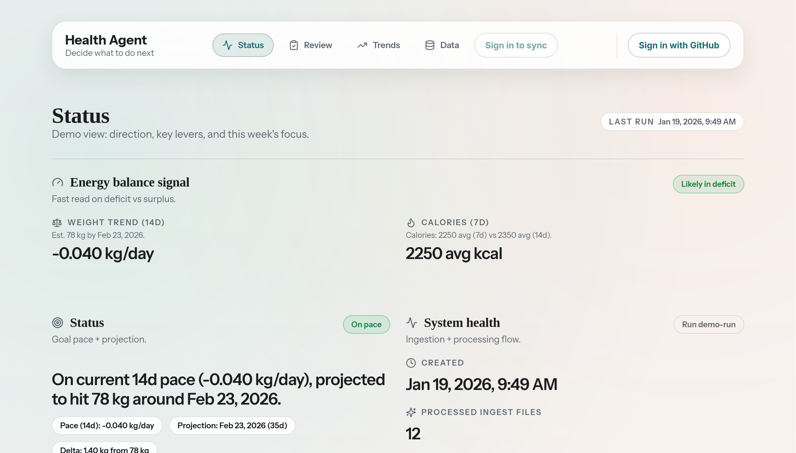

# HealthAgent

HealthAgent turns daily Apple Health exports into a clean, opinionated health summary.

- API: Fastify + Prisma (Postgres)
- Web: Next.js App Router
- Raw storage: local disk (dev) or GCS (cloud)
- Auth: NextAuth (GitHub) with per-user ingest tokens and user-scoped data

Quick walkthrough: [ONBOARDING.md](docs/ONBOARDING.md).

## What it does

- Daily ingest → canonical tables → metrics pack
- Optional weekly insights doc (diff-based)
- UI focused on trend + next actions

## Screenshot



## Repo layout

- `apps/api` — Fastify API + Prisma
- `apps/web` — Next.js frontend
- `storage/local` — local raw ingest storage (dev)

## Run locally

Prereqs: Node 20+, pnpm, Docker.

```bash
pnpm i
pnpm db:up
pnpm db:generate
pnpm db:migrate

cp apps/api/.env.example apps/api/.env
cp apps/web/.env.example apps/web/.env.local
pnpm dev
```

- API: http://localhost:3001/health
- Web: http://localhost:3000

Notes:
- API loads dotenv from `apps/api/.env`.
- Set the same `INTERNAL_API_KEY` and `PIPELINE_TOKEN` in both env files.
- `NEXTAUTH_SECRET`, `GITHUB_CLIENT_ID`, and `GITHUB_CLIENT_SECRET` are required for sign-in.

## Try it quickly (sample data)

This repo includes a small Health Auto Export sample. It will write the sample into local storage and run the full pipeline:

```bash
pnpm --filter @health-agent/api seed:sample
pnpm --filter @health-agent/api legacy:migrate -- --target-user-id <user-id>
```

Then open:

- Dashboard: http://localhost:3000
- Insights: http://localhost:3000/insights

## Key endpoints

- `POST /api/ingest/apple-health` (auth: per-user `X-INGEST-TOKEN` or `Authorization: Bearer <token>`)
- `POST /api/pipeline/run` (auth: `X-INTERNAL-API-KEY` + `X-USER-ID`, or `X-PIPELINE-TOKEN` + `X-USER-ID`)
- `GET /api/pipeline/latest` (auth: `X-INTERNAL-API-KEY` + `X-USER-ID`)
- `GET /api/insights/latest` (auth: `X-INTERNAL-API-KEY` + `X-USER-ID`)
- `GET /api/data-quality/summary` (auth: `X-INTERNAL-API-KEY` + `X-USER-ID`)

## Config (API)

See `apps/api/.env.example` and `apps/web/.env.example` for the full lists. Common ones:

- `INGEST_TOKEN`
- `INTERNAL_API_KEY`
- `PIPELINE_TOKEN`
- `PIPELINE_MAX_INGESTS_PER_RUN` (default `25`)
- `API_BASE_URL` (for the web app to call the API)
- `NEXT_PUBLIC_SITE_URL` (canonical web URL for metadata, sitemap, and llms.txt)
- `NEXTAUTH_SECRET` + `GITHUB_CLIENT_ID` + `GITHUB_CLIENT_SECRET` (web auth)
- `DATABASE_URL`
- `STORAGE_PROVIDER=local|gcs` (+ `STORAGE_LOCAL_DIR` or `STORAGE_BUCKET`)
- `INSIGHTS_ENABLED` (optional, default false)
- `OPENAI_API_KEY` + `INSIGHTS_MODEL` (optional; only used when `INSIGHTS_ENABLED=true`)
- `INSIGHTS_OPENAI_TIMEOUT_MS` / `INSIGHTS_TINKER_TIMEOUT_MS` (optional request timeouts, ms)
- `TINKER_API_KEY` + `TINKER_MODEL_PATH` (optional alternative backend for insights)
- Target weight is set in the Preferences tab (used for projected timeline)

## Enable LLM insights

- Copy `apps/api/.env.example` to `apps/api/.env` and set `INSIGHTS_ENABLED=true`.
- Add your OpenAI key to `OPENAI_API_KEY` and choose a chat-completions model for `INSIGHTS_MODEL` (e.g. `gpt-4o-mini`) in `apps/api/.env`.
- Keep the key server-side only; the web app never needs it. Trigger insights generation by running the pipeline (`POST /api/pipeline/run` with `x-internal-api-key` + `x-user-id` headers, or use `pnpm --filter @health-agent/api seed:sample` locally).
- Alternatively, set `TINKER_API_KEY` (with `TINKER_MODEL_PATH`) to use the Tinker bridge backend.

## Deploy

GCP deployment (Cloud Run + GCS + Cloud Scheduler + external/serverless Postgres like Neon) is documented in [DEPLOY_GCP.md](docs/DEPLOY_GCP.md).

## Cost notes (<$10/month)

- Cheapest: run local only.
- If cloud: prefer serverless Postgres + pay-per-use compute.
- Cloud SQL is always-on; set a billing alert if you use it.

## Docs

- [Onboarding guide](docs/ONBOARDING.md)
- [GCP deployment](docs/DEPLOY_GCP.md)
- [Frontend style guide](docs/STYLE_GUIDE.md)
- [Project status](docs/tasks.md)
